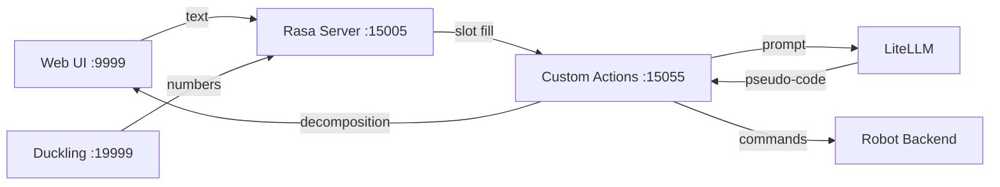

# Architecture

## Overview

Spark follows a three-party pipeline: **User** (web chat) <-> **LLM** (decomposition) <-> **Robot** (execution).

## Components

### Rasa dialogue (`data/`, `domain.yml`, `config.yml`)

Manages conversation flow: greeting, instruction collection, program revision (change/add/delete blocks), and confirmation. Duckling extracts block numbers from user utterances.

### Custom actions (`actions/actions.py`)

Central orchestrator. Key steps per instruction:

1. **ValidateInstructionForm** — sends user text to LLM, parses decomposition output, validates pseudo-code syntax
2. **ActionProcessInstruction** — stores the program and announces intent
3. **ActionRunProgram** — serializes and dispatches commands to the robot thread
4. **Revision actions** — allow block-level editing with LLM assistance for new instructions

### LLM engine (`actions/engine/generator.py`)

Unified LiteLLM wrapper supporting:
- Commercial: `gpt-4o-mini` via OpenAI API
- Local: `openai/gpt-oss-20b` via vLLM OpenAI-compatible endpoint

Multiple prompt templates are registered via `add_prompter()` and selected by index during generation.

### Prompts (`actions/prompts/`)

| File | Constant | Role |
|------|----------|------|
| `decompose_direct.py` | `PROMPT` | Direct program generation (no 7-section breakdown) |
| `decompose_structured.py` | `PROMPT_PSEUDO` | Structured decomposition (goal, steps, control, code, rationale) |
| `decompose_structured_exp2.py` | `PROMPT_PSEUDO` | Legacy structured prompt (reference only) |
| `revise_block.py` | `PROMPT_TO_REVISE` | Revise a single program block |
| `classify_instruction.py` | `PROMPT_TO_CLASSIFY` | Instruction vs conversation |
| `normalize_pseudo_instruction.py` | `PROMPT_TO_MAKE_PSEUDO` | Normalize user text to pseudo-instruction |
| `find_similar_instruction.py` | `PROMPT_TO_FIND_SIMILAR` | Find similar prior instructions |

### Robot backends (`actions/robot/`)

| Backend | Class | Behavior |
|---------|-------|----------|
| `noop` (default) | `NoopRobotBackend` | Accepts all valid syntax, logs commands |
| `go1` | `go1_highcommand` | Real Unitree Go1 via free-dog-sdk |

Selection via `SPARK_ROBOT_BACKEND` in `.env`.

### Web UI (`actions/web/`)

Flask app embedded in the actions server. Displays camera feed, chat, task breakdown, logic flow, and generated pseudo-code. Communicates with Rasa via REST webhook.

## Configuration

All settings flow through `actions/config.py`, reading environment variables from `.env`. No API keys or hostnames are hardcoded.

## Optional modules (`optional/`)

STT, TTS, vision, and database modules are isolated and not imported unless their feature flags are enabled. See each subdirectory's README.
